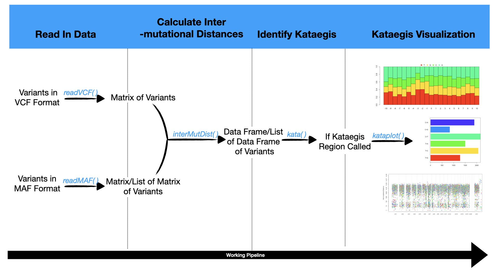
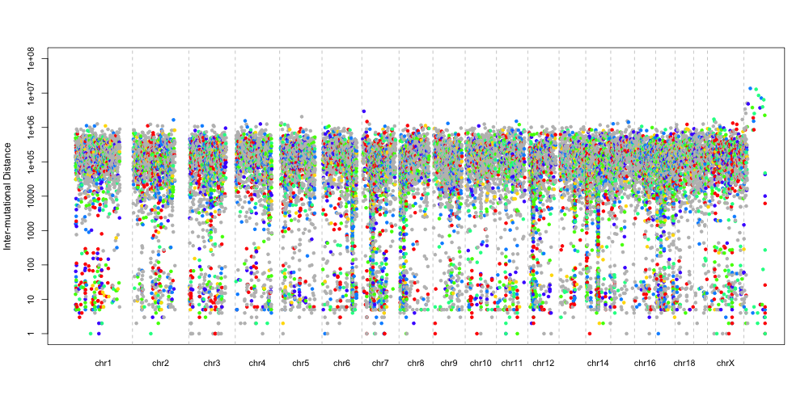

```{r setup, include=FALSE}
knitr::opts_chunk$set(echo = TRUE)
```

+ Contents
    + Introduction
    + Overview
    + Data Input
    + Read In Data
    + Calculate The Inter-mutational Distances
    + Kataegis Region Identification
    + Kataegis Region Visualization
    + References

## Introduction

This is a documentation for kataegis package which provides tools for the 
identification and visualization of the genomic localized hypermutation region, 
i.e. kataegis. Researchers have found that the localized hypermutations occur 
in a way that is quite different from the usual somatic muations in the aspect of
the mutations' occurency and genomic density. This hypermuatation is like a violent 
strom, that is what the greek word '<em>kataegis</em>' means. This phenomena was found in 
the breast and squamous cell carcinoma (SCC), more and more reseaches report this 
phenomena in other types of cancers as well^1^. There were evidences showed that 
the kataegis, which is induced by AID/APOBEC cytosine deaminase, is related to 
the proganosis, and the possible treatment strategies decision^2,3^. Thus, the 
package can meet the needs of a light-weighted and simple-to-use toolkit for quick 
identifying and visualizing the kataegis of the genomes.

## Overview



## Data Input

There are two accepted formats of variant file by this package currently: VCF and MAF. 

The VCF format is an abbreviation for the Variant Call Format，which is a text 
file format for storing variants information. For this format of file, the columns 
of '#CHROM', 'POS', 'ID', 'REF', 'ALT', 'QUAL', and 'FILTER' are obliged. Detailed 
information of the VCF format please refer to the Variant Call Format (VCF) 
Version 4.2 Specification^4^.

The MAF format is an abbreviation for Mutation Annotation Format, which is also a 
text fie format for storing variants information for one or more than one samples.
For this format of files, the columns of 'Chromosome', 'Start_Position',
'End_Position', 'Reference_Allele', 'Tumor_Seq_Allele2', are obliged. Detailed
information of the MAF format, please refer to the Mutation Annotation Format
(MAF) GDC Version 1.0.0 Specification^5^.

It is strongly recomendated to filter and convert your own data before you read 
them in, though the funcions has their own crude filters.

We have two psudo example data files come with this pacakge: test_mut.vcf and test_mut.maf,
which will be used to show the usage of the analysis procedure.

## Read In Data

Here is how we read in a VCF file:

```{r echo=TRUE}
library(kataegis)
fpath <- system.file("extdata", "test_mut.vcf", package="kataegis")
dat<-readVCF(fpath)
head(dat)
```

Note: As the VCF file is a psudo one, the 'FILTER' field does not contain detailed 
information, that's why a warning message rise. The data will still be read
in without any obstruction for further analysis, but it is strongly recommendated
for users to filter and add the filter result, e.g. 'PASS' for passing all filters,
before you read in data to avoid any bias for the further steps.

When you need to read in a MAF file, you can choose two methods: to merge all the 
samples together, e.g. replicates, or to split each samples.

```{r echo=TRUE}
fpath <- system.file("extdata", "test_mut.maf", package="kataegis")
dat<-readMAF(fpath) # merge all the samples together
head(dat)
```

The output of this method generate a matrix just like readVCF did, while the 
other split mode method will generate a list of matrix.

```{r echo=TRUE}
fpath <- system.file("extdata", "test_mut.maf", package="kataegis")
dat<-readMAF(fpath, split=TRUE) # split each sample in the MAF file
str(dat)
```

And the 'ESCC-148T' and 'ESCC-184T' are the sample IDs.

## Calculate The Inter-mutational Distances

As the kataegis is usually identified as a small genomic region with high 
occurency and density of mutations, we used a method call piece-wise constant 
fitting^6^ to find the regions of constant inter-mutational distance, thus a inter
-mutational distances of each variant should be calculated before kataegis iden
-tification.

```{r echo=TRUE}
fpath <- system.file("extdata", "test_mut.vcf", package="kataegis")
dat<-readVCF(fpath)
dist<-interMutDist(dat)
head(dist)
```

The output data frame contains the columns of 'CHR', 'POS', and 'DISTANCE', which
presents the chromosome of the variant, the position of the variant and the 
distance of the variant to its neighbour variant respectively.

The mergeed MAF read in file is exactly the same analysis step with the VCF read
in file. If you're working with splitted read in MAF, then

```{r echo=TRUE}
fpath <- system.file("extdata", "test_mut.maf", package="kataegis")
dat<-readMAF(fpath, split=TRUE) #merge all the samples together
dist<-interMutDist(dat)
str(dist)
```

As there are samples with too few mutations wich is not sufficient to calculate 
the inter-muational distances, these samples will be abandoned and a warning 
describing the situation and listing the samples' ID will arise.

## Kataegis Region Identification

```{r echo=FALSE}
seg<-kata(dist) # to identify the kataegis region with default paramters
```

As the psudo data has two few mutations to call kataegis, wich is usually identified
as a genomic region with six or more mutations and average inter-muational distances
less or equal to 1000bp, the kataegis identification just failed on the psudo data
with default parameters. To present the full analysis pipeline, we will use the 
use-defined parameters in this documentation.

```{r echo=TRUE}
#For MAF files
fpath <- system.file("extdata", "test_mut.maf", package="kataegis") #get the path of the MAF file
dat<-readMAF(fpath, split=TRUE)# read in the maf file with samples seperated
dist<-interMutDist(dat) # calcualte the inter-mutational distances
seg<-kata(dist, len=5e6, assembly="hg19") # to identify the kataegis region with user set paramters
str(seg)

#For VCF files
fpath <- system.file("extdata", "test_mut.vcf", package="kataegis") # get the path of the VCF file
dat<-readVCF(fpath) # read in the vcf file
dist<-interMutDist(dat) # calculate the inter-muational distances
seg<-kata(dist, len=5e4, assembly="mm10") # to identify the kataegis region with user set paramters
head(seg)
```

The analysis for MAF file with samples merged or seperated uses the same procedure
as the VCF file analysis, except that the 'split' is set to 'TRUE' when read in 
the MAF file. And in the functions for kataegis identificaiton and visualizaiton,
the seperated samples will be analyzed individually and the output will be named
by the sample IDs.

Please be notified that the default parameters for identifying a kataegis region
is more than 6 variants within 1Kb genomic region, which is putative and it is
usually advisable to use the default parameters, but you can also set the
parameters according to your specific genomes.

## Kataegis Region visualization

If you have the kataegis identified, you can also visualize the nucleotides types,
mutation types and the distribution of the mutations on genome.

```{r echo=TRUE}
kataplot(dat, seg, dist)
```

If you have analyzed a VCF file or a merged MAF file, you'll get the visualization
of all the variants, or if you're dealing with a seperated MAF file, all the 
following plots will be generated for each sample.


This is the barplot of all the conversions of all the mutations in kataegis regions
identified.


    
This is the stack barplot of all the nucleotides content of all the mutations in
kataegis regions identifed.


    
This is the rainfall plot of all the mutations distribution on the genome. As the 
limitation of the size of the example data, here we only have the VCF file of one
chromosome. If you have all the variants of the genome you'll also get the rain
-fall plot as the following. Thus, if you want to visualize the data seperately 
as a chromosome, you can split the VCF according to the chromosome before you 
start the analysis pipeline.


    
## References

1. B.Alexandrov, L., Nik-Zainal, S., Wedge, D. C., Aparicio, S. A. J. R., Behjati, S., Biankin, A. V., … et.al. (2013). Signatures of mutational processes in human cancer. Nature, 500, 415–421. https://doi.org/10.1038/nature12477

2. Lada, A. G., Dhar, A., Boissy, R. J., Hirano, M., Rubel, A. A., Rogozin, I. B., & Pavlov, Y. I. (2012). AID / APOBEC cytosine deaminase induces genome-wide kataegis, 1–7.

3. Han, M., Shin, S., Park, H., Kim, M. S., Lee, S. H., Jung, S. H., … Chung, Y. (2018). Mutational signatures and chromosome alteration pro fi les of squamous cell carcinomas of the vulva. Nature Publishing Group, 50(2), e442-13. https://doi.org/10.1038/emm.2017.265

4. Info, Q. F. (2020). The Variant Call Format ( VCF ) Version 4 . 2 Specification The VCF specification, 1–28.

5. https://docs.gdc.cancer.gov/Data/File_Formats/MAF_Format/

6. Nilsen, G., Liestøl, K., Loo, P. Van, Kristian, H., Vollan, M., Eide, M. B., … Lingjærde, O. C. (2012). Copynumber : Efficient algorithms for single- and multi-track copy number segmentation.


